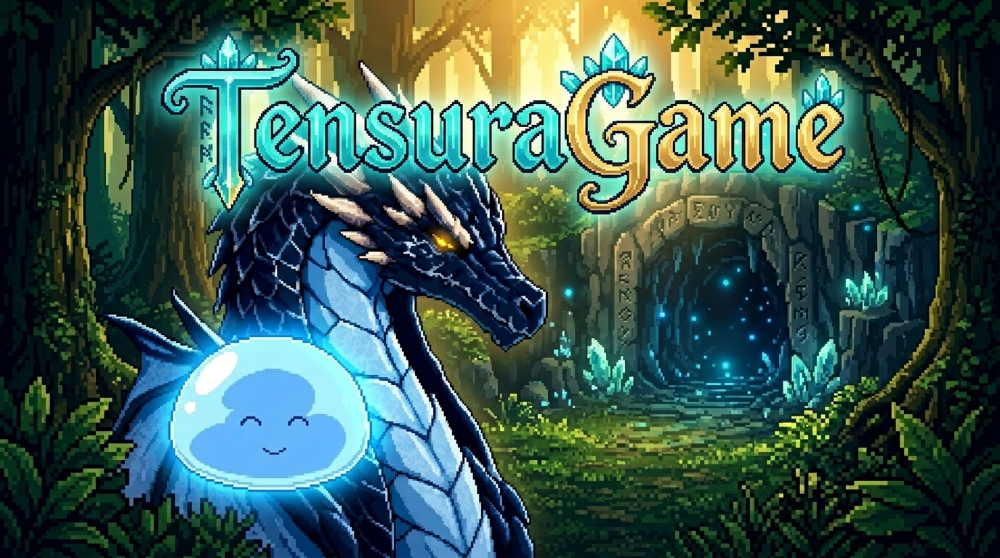

<p align="center">
  
</p>

<h1 align="center">TensuraGame</h1>

<p align="center">
  
  
  
  
  
</p>

<p align="center">
  RPG 2D autoral em pixel art inspirado no universo de That Time I Got Reincarnated as a Slime (Tensura), desenvolvido sobre o motor grafico IgnisEngine. O projeto combina exploracao top-down, narrativa dinamica orientada por dados com cutscenes cinematograficas, combate tatico por turnos reativo e construcao progressiva da vila de Tempest.
</p>

---

## Visao Geral e Destaques

- **Narrativa e Cutscenes Orientadas por Dados:** Dialogos e eventos roteirizados via JSON em `project/data/`, com avanco manual, reacoes faciais em retratos de alta expressao e transicoes de camera suaves.
- **Ator Persistente Unico:** Controle de Rimuru em forma de Slime com fisica continua, preservando coordenadas, inventario e habilidades entre cenarios e cutscenes.
- **Sistema de Batalha Tatico (`BattleDirector`):** Duelos com mecanica de janelas de reacao (`ReactionWindow`), comandos adaptativos, contencao deterministica de texto (`fitToBox`) e preservacao integral do estado autorado da cena (`WidgetState`).
- **Arquitetura de Dominio Desacoplada (`domain-lib`):** Regras puras de gameplay, progressao e simulacao sem acoplamento com rendering ou UI, validadas por testes unitarios independentes.
- **Persistencia Atomica e Migracao Versionada (`persistence-lib`):** Gerenciador de saves transacional imune a corrupcao de arquivos, com cadeia de migracao automatica de esquemas (V1 -> V2 -> V3).
- **Construcao e Gestao de Tempest (`TownDirector`):** Progressao de infraestrutura da aldeia, oficinas de forja de Dwargon com Kaijin, alocacao de recursos e defesas contra ameacas da Floresta de Jura.

---

## Arcos Narrativos Implementados

1. **Despertar na Caverna do Selo:** Consciencia inicial, absorcao de ervas Hipokute e minerio Magisteel, e primeiro dialogo com a habilidade unica Grande Sabio.
2. **O Dragao da Tempestade (Veldora):** Encontro no coracao da caverna, quebra do isolamento e pacto de amizade com a absorcao de Veldora via habilidade Predador.
3. **Travessia e Primeiro Contato Goblin:** Saida da caverna e encontro pacifico com os batedores e o anciao Rigurd na Floresta de Jura.
4. **Defesa da Aldeia e Duelo dos Lobos:** Conflito tatico contra a matilha dos Lobos Terriveis, confronto direto com o lider da matilha e negociacao de rendicao.
5. **Nomeacao de Ranga e Evolucao:** Cerimonia de concessao de nomes, transformacao dos monstros e fortalecimento das relacoes com a aldeia.
6. **Expedicao a Dwargon e Recrutamento:** Viagem aos portoes do reino dos anoes, negociacao com os ferreiros artesaos (Kaijin) e instalacao das oficinas em Tempest.

---

<details>
  <summary><b>Estrutura de Diretorios</b></summary>

```text
TensuraGame/
├── TensuraGame.ignis         # Cena principal e definicoes do projeto no formato Ignis
├── build.json                # Metadados de compilacao e empacotamento standalone
├── pom.xml                   # Configuracao raiz do Maven para as bibliotecas do projeto
├── Icons/                    # Identidade visual e banner do repositorio
│   └── Banner.jpg            # Banner pixel art em alta resolucao
├── domain-lib/               # Biblioteca de regras puras e simulacao (Java Puro)
│   ├── src/main/java/        # Maquinas de estado, escolhas, missoes e cidade
│   └── src/test/java/        # 166 testes unitarios automatizados
├── persistence-lib/          # Camada de persistencia atomica e codec de documentos
│   ├── src/main/java/        # Gravacao segura de saves e caminhos de usuario
│   └── src/test/java/        # 22 testes de persistencia e tolerancia a falhas
├── project/                  # Dados de runtime consumidos pela engine
│   ├── assets/               # Sprites, portraits, backgrounds, vfx e sons
│   ├── data/                 # Contratos narrativos, cutscenes e mapas em JSON
│   ├── libs/                 # JARs compilados das bibliotecas de suporte
│   ├── prefabs/              # Modelos reutilizaveis de entidades de jogo
│   └── scripts/              # Directores e controladores do jogo (IgnisScript)
└── tools/                    # Utilitarios Python e validadores de contrato de QA
    ├── extract_directional_sheet.py
    ├── process_battle_hud_assets.py
    └── validate_cutscene_polish_contract.py
```
</details>

---

<details>
  <summary><b>Como Executar Localmente</b></summary>

### Pre-requisitos
- **Java:** JDK 17 LTS ou superior instalado e configurado nas variaveis de ambiente (`JAVA_HOME`).
- **IgnisEngine:** Versao recente do motor grafico IgnisEngine.

### Passo a Passo
1. Clone ou posicione a pasta do projeto no diretorio de projetos da engine:
   ```cmd
   IgnisEngine-main/projects/TensuraGame/
   ```
2. Abra o executavel do editor da IgnisEngine (modo JavaFX).
3. Pelo menu **Arquivo > Abrir Projeto**, selecione o arquivo `TensuraGame.ignis`.
4. Apos o carregamento dos assets e scripts, pressione o botao **Play** na barra de ferramentas para iniciar a simulacao.
</details>

---

<details>
  <summary><b>Suites de Testes e Contratos de QA</b></summary>

### Testes das Bibliotecas (Domain & Persistence)
A logica do jogo e coberta por 188 testes unitarios que podem ser executados sem inicializar a engine grafica:

```powershell
# Executar a suite completa via Maven
mvn test
```

### Validadores de Contratos e Ritmo Narrativo
Scripts Python estao disponiveis em `tools/` para auditoria estatica de tempos, dialogos e integridade de assets:

```powershell
# Validar ritmo de cutscene e handoff de controle
python tools/validate_awakening_rhythm.py

# Validar cobertura de comandos e grades de reacao da batalha
python tools/validate_battle_polish_contract.py

# Validar dimensoes e areas de expansao do mapa
python tools/validate_cave_map_expansion_contract.py
```
</details>

---

<details>
  <summary><b>Pipeline de Assets e Sprites Direcionais</b></summary>

O motor utiliza folhas de sprites em grade direcional `3x4` (colunas: *Walk A*, *Idle*, *Walk B*; linhas: *Down*, *Left*, *Right*, *Up*).

Para processar novas artes brutas com recorte automatico de fundo e geracao de quadros canonicos com pivot centro-inferior:

```powershell
python tools/extract_directional_sheet.py `
  --input project/assets/source/personagem_sheet_alpha.png `
  --output-dir project/assets/sprites/npcs/personagem `
  --prefix personagem `
  --canvas 64
```
</details>

---

## Projeto de Fa e Politica de Uso

Este e um projeto de fa, nao comercial e sem fins lucrativos. *That Time I Got Reincarnated as a Slime* (Tensura) e seus respectivos personagens, conceitos e universo sao propriedade de Fuse, Mitz Vah, Kodansha e do Comite de Producao de Tensura. Codigo-fonte, ferramentas, adaptacoes narrativas e integracoes com a IgnisEngine sao autorais.

---

<p align="center">
  <a href="https://github.com/ThyagoToledo">
    
  </a>
  <br />
  <sub><b>Autor: ThyagoToledo</b></sub>
</p>
